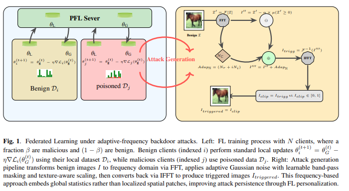
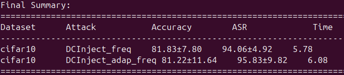

# DCInject: Adaptive Frequency-Domain Backdoor Attack for PFL

Official implementation of DCInject, a novel frequency-domain backdoor attack for personalized federated learning.

## Abstract

Personalized federated learning (PFL) creates client-specific models to handle data heterogeneity. Previously, PFL has been shown to be naturally resistant to backdoor attack propagation across clients. In this work, we reveal that PFL remains vulnerable to backdoor attacks through a novel frequency-domain approach. We propose **DCInject**, an adaptive frequency-domain backdoor attack for PFL, which removes portions of the zero-frequency (DC) component and replaces them with Gaussian-distributed samples in the frequency domain. Our attack achieves superior attack success rates while maintaining clean accuracy across four datasets (CIFAR-10/100, GTSRB, SVHN) compared to existing spatial-domain attacks, evaluated under parameter decoupling based personalization. DCInject achieves superior performance with ASRs of 96.83% (CIFAR-10), 99.38% (SVHN), and 100% (GTSRB) while maintaining clean accuracy. Under I-BAU defense, DCInject demonstrates strong persistence, retaining 90.30% ASR vs BadNet's 58.56% on VGG-16, exposing critical vulnerabilities in PFL security assumptions.

## Requirements

- Python 3.9+
- PyTorch (GPU)
- numpy, torchvision, pillow (install as needed)

## Installation

conda environment and install dependencies as you encounter missing packages:

**GPU Setup:**
```bash
conda create -n dcinject-gpu python=3.9
conda activate dcinject-gpu
pip install -r dcinject_requirements.txt
```

## Methodology

The core innovation of DCInject is manipulation in the frequency domain. The attack works by:

1. Converting input images to the frequency domain using FFT
2. Identifying and removing portions of the DC (zero-frequency) component
3. Replacing removed portions with Gaussian-distributed noise sample
4. Converting back to spatial domain



## Usage

Run DCInject attack on CIFAR-10 with defualt configs:

```bash
python dcinject.py --dataset CIFAR10
```

## Results: Attack Success Rate and ACC




## Citation

If you find this work useful, please cite:

```bibtex
@misc{dcinject2026,
  title={{DCInject}: Adaptive frequency-domain backdoor attack for personalized federated learning},
  author={Author et al.},
  year={2026},
  eprint={2602.18489},
  archivePrefix={arXiv},
  primaryClass={cs.LG},
  url={https://arxiv.org/abs/2602.18489}
}
```
